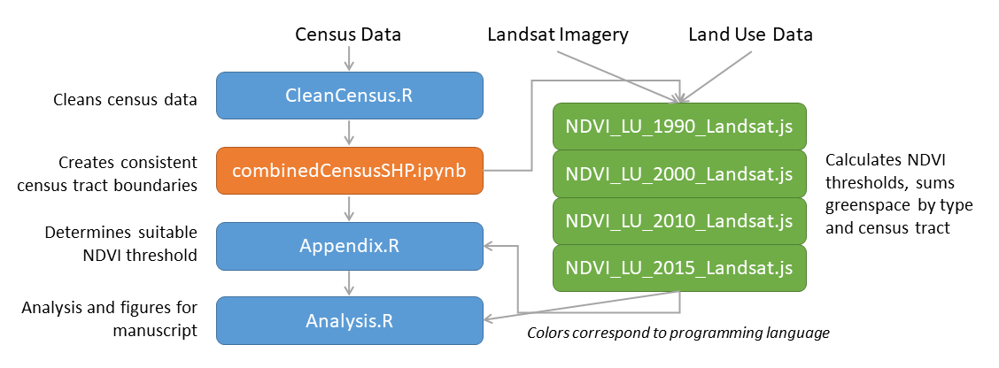

# The role of formal and informal greenspace in Chicago’s gentrification
Empirical examination of the role of formal and informal greenspace in environmental gentrification in Chicago between 1990 and 2015. Analysis employs publicly available satellite, census, and land use data (see below for the list of data and sources). 

## Citation:
Stuhlmacher, Michelle, Yushim Kim, and Ji Eun Kim. (2022). “The Role of Green Space in Chicago’s Gentrification.” Urban Forestry & Urban Greening, 71. https://doi.org/10.1016/j.ufug.2022.127569.

## Methodology Diagram:

# Software Requirements:
R version 4.0.2

Google Earth Engine (JavaScript API)

Python 3.8.5 (Jupyter Notebook 6.1.4)

# Publicly Available Data Sources:
U.S. Census and American Community Survey Data: https://www.nhgis.org/ 

Chicago Metropolitan Agency for Planning, Land Use Inventories: https://datahub.cmap.illinois.gov/group/land-use-inventories 

U.S. Department of Housing and Urban Development, Public Housing Buildings: https://hudgis-hud.opendata.arcgis.com/datasets/public-housing-buildings/explore?location=41.272636%2C-115.070600%2C4.26  

City of Chicago GIS Data: https://data.cityofchicago.org/browse?tags=gis 

### Accessed via Google Earth Engine:
USGS Landsat 5 TM Collection 1 Tier 1 Raw Scenes: https://developers.google.com/earth-engine/datasets/catalog/LANDSAT_LT05_C01_T1 

USGS Landsat 8 Collection 1 Tier 1 and Real-Time data Raw Scenes: https://developers.google.com/earth-engine/datasets/catalog/LANDSAT_LC08_C01_T1_RT 
